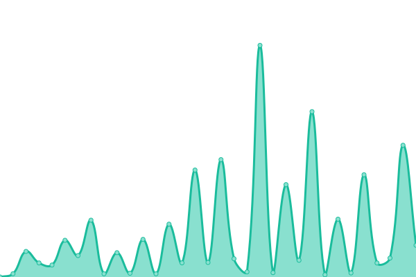

# [📈 Live Status](https://v4lerio.github.io/infosecnews-help-gov-it): <!--live status--> **🟧 Partial outage**

This repository contains the open-source uptime monitor and status page for [Valerio Cestrone](https://v4lerio.github.io/infosecnews-help-gov-it), powered by [Upptime](https://github.com/upptime/upptime).

With [Upptime](https://upptime.js.org), you can get your own unlimited and free uptime monitor and status page, powered entirely by a GitHub repository. We use [Issues](https://github.com/v4lerio/infosecnews-help-gov-it/issues) as incident reports, [Actions](https://github.com/v4lerio/infosecnews-help-gov-it/actions) as uptime monitors, and [Pages](https://v4lerio.github.io/infosecnews-help-gov-it) for the status page.

<!--start: status pages-->
<!-- This summary is generated by Upptime (https://github.com/upptime/upptime) -->
<!-- Do not edit this manually, your changes will be overwritten -->
<!-- prettier-ignore -->
| URL | Status | History | Response Time | Uptime |
| --- | ------ | ------- | ------------- | ------ |
|  [Parlamento](https://www.parlamento.it/) | 🟩 Up | [parlamento.yml](https://github.com/v4lerio/infosecnews-help-gov-it/commits/HEAD/history/parlamento.yml) | 

 1235ms
     
 | 

<a href="https://v4lerio.github.io/infosecnews-help-gov-it/history/parlamento">100.00%</a>
    

|  [Agenzia delle Entrate](https://www.agenziaentrate.gov.it/) | 🟩 Up | [agenzia-delle-entrate.yml](https://github.com/v4lerio/infosecnews-help-gov-it/commits/HEAD/history/agenzia-delle-entrate.yml) | 

 2357ms
     
 | 

<a href="https://v4lerio.github.io/infosecnews-help-gov-it/history/agenzia-delle-entrate">100.00%</a>
    

|  [Governo](https://www.governo.it/) | 🟩 Up | [governo.yml](https://github.com/v4lerio/infosecnews-help-gov-it/commits/HEAD/history/governo.yml) | 

 442ms
     
 | 

<a href="https://v4lerio.github.io/infosecnews-help-gov-it/history/governo">100.00%</a>
    

|  [Salute](http://www.salute.gov.it/) | 🟥 Down | [salute.yml](https://github.com/v4lerio/infosecnews-help-gov-it/commits/HEAD/history/salute.yml) | 

 0ms
     
 | 

<a href="https://v4lerio.github.io/infosecnews-help-gov-it/history/salute">0.08%</a>
    

|  [Esteri](https://www.esteri.it/) | 🟨 Degraded | [esteri.yml](https://github.com/v4lerio/infosecnews-help-gov-it/commits/HEAD/history/esteri.yml) | 

 6858ms
     
 | 

<a href="https://v4lerio.github.io/infosecnews-help-gov-it/history/esteri">2.98%</a>
    

|  [Giustizia](https://www.giustizia.it/) | 🟩 Up | [giustizia.yml](https://github.com/v4lerio/infosecnews-help-gov-it/commits/HEAD/history/giustizia.yml) | 

 1560ms
     
 | 

<a href="https://v4lerio.github.io/infosecnews-help-gov-it/history/giustizia">100.00%</a>
    

|  [Interno](https://www.interno.gov.it/) | 🟩 Up | [interno.yml](https://github.com/v4lerio/infosecnews-help-gov-it/commits/HEAD/history/interno.yml) | 

 1102ms
     
 | 

<a href="https://v4lerio.github.io/infosecnews-help-gov-it/history/interno">100.00%</a>
    

|  [Difesa](https://www.difesa.it/) | 🟩 Up | [difesa.yml](https://github.com/v4lerio/infosecnews-help-gov-it/commits/HEAD/history/difesa.yml) | 

 1864ms
     
 | 

<a href="https://v4lerio.github.io/infosecnews-help-gov-it/history/difesa">100.00%</a>
    

|  [Economia e Finance (MEF)](https://www.mef.gov.it/) | 🟩 Up | [economia-e-finance-mef.yml](https://github.com/v4lerio/infosecnews-help-gov-it/commits/HEAD/history/economia-e-finance-mef.yml) | 

 2091ms
     
 | 

<a href="https://v4lerio.github.io/infosecnews-help-gov-it/history/economia-e-finance-mef">100.00%</a>
    

|  [Sviluppo Economico](https://www.mise.gov.it/) | 🟩 Up | [sviluppo-economico.yml](https://github.com/v4lerio/infosecnews-help-gov-it/commits/HEAD/history/sviluppo-economico.yml) | 

 2466ms
     
 | 

<a href="https://v4lerio.github.io/infosecnews-help-gov-it/history/sviluppo-economico">100.00%</a>
    

|  [Universit&agrave; e Ricerca (MUR)](https://www.mur.gov.it/) | 🟩 Up | [universit-and-agrave-e-ricerca-mur.yml](https://github.com/v4lerio/infosecnews-help-gov-it/commits/HEAD/history/universit-and-agrave-e-ricerca-mur.yml) | 

 1760ms
     
 | 

<a href="https://v4lerio.github.io/infosecnews-help-gov-it/history/universit-and-agrave-e-ricerca-mur">100.00%</a>
    

|  [Lavoro](https://www.lavoro.gov.it/) | 🟩 Up | [lavoro.yml](https://github.com/v4lerio/infosecnews-help-gov-it/commits/HEAD/history/lavoro.yml) | 

 1074ms
     
 | 

<a href="https://v4lerio.github.io/infosecnews-help-gov-it/history/lavoro">100.00%</a>
    

|  [Infrastrutture e Trasporti](https://www.mit.gov.it/) | 🟩 Up | [infrastrutture-e-trasporti.yml](https://github.com/v4lerio/infosecnews-help-gov-it/commits/HEAD/history/infrastrutture-e-trasporti.yml) | 

 1697ms
     
 | 

<a href="https://v4lerio.github.io/infosecnews-help-gov-it/history/infrastrutture-e-trasporti">100.00%</a>
    

<!--end: status pages-->

[**Visit our status website →**](https://v4lerio.github.io/infosecnews-help-gov-it)

## 📄 License

- Powered by: [Upptime](https://github.com/upptime/upptime)
- Code: [MIT](./LICENSE) © [Valerio Cestrone](https://v4lerio.github.io/infosecnews-help-gov-it)
- Data in the `./history` directory: [Open Database License](https://opendatacommons.org/licenses/odbl/1-0/)
